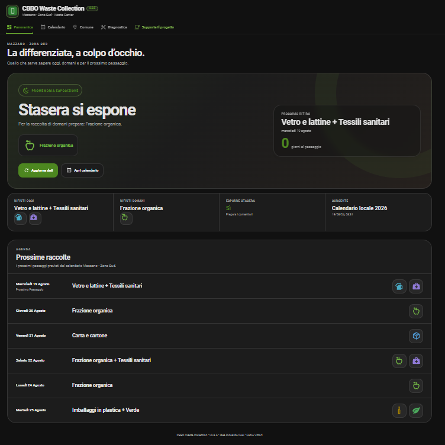
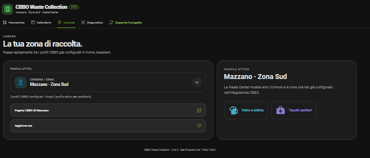

# ♻️ CBBO Waste Collection

**🇮🇹 Italiano** · [🇬🇧 English](#-english)

Integrazione custom per Home Assistant dedicata ai calendari della raccolta differenziata CBBO e alla nuova **Waste Center**.

> CBBO® e il relativo logo appartengono ai rispettivi proprietari. Questa è un'integrazione indipendente per Home Assistant e non è affiliata né approvata ufficialmente da CBBO.

## 🇮🇹 Italiano

### 🧹 Novità v3.0.0

La 3.0 è una release di consolidamento: stessa esperienza per l'utente, ma base tecnica molto più pulita e facile da mantenere.

- codice Python riformattato e tipizzato;
- eliminati import wildcard, righe compresse e duplicazioni nelle entità;
- gestione cache/fallback separata in metodi chiari;
- frontend ripulito rimuovendo il vecchio meccanismo duplicato degli stili;
- suite test con nomi permanenti, senza file legati alle singole versioni;
- workflow GitHub semplificati e coerenti;
- nessuna modifica agli entity ID, ai Comuni configurati o ai calendari.

### ✨ Funzioni principali

- calendario raccolta differenziata;
- sensori Oggi, Domani e Prossimo ritiro;
- promemoria **“Stasera si espone”**;
- supporto a più Comuni / zone configurati;
- pannello Waste Center responsive desktop/mobile;
- interfaccia **Italiano / English**;
- nuova pagina **Centro di raccolta** con stato aperto/chiuso, orari di oggi, prossima apertura, settimana completa, indirizzo e modalità di accesso;
- gestione automatica degli orari stagionali per i Comuni che li prevedono;
- collegamento diretto alla pagina CBBO ufficiale;
- diagnostica, cache e fallback locale dei calendari.

### 🏘️ Comuni supportati

Acquafredda, Barbariga, Calvisano, Capriano del Colle, Carpenedolo, Castenedolo, Flero, Ghedi, Isorella, Mazzano, Montichiari, Montirone, Nuvolento, Nuvolera, Poncarale, Remedello, San Zeno Naviglio e Visano.

Mazzano supporta **Zona Nord** e **Zona Sud**.

### ♻️ Centro di raccolta

La v3.0.0 mantiene la pagina dedicata agli orari standard dei Centri di Raccolta CBBO.

La pagina mostra:

- **Aperto ora / Chiuso**;
- orari della giornata;
- prossima apertura;
- orari settimanali;
- periodo stagionale attivo;
- indirizzo;
- informazioni di accesso quando disponibili;
- avvisi per centri temporaneamente chiusi e centri alternativi;
- link alla pagina ufficiale CBBO.

Gli orari inclusi nella v3.0.0 sono stati verificati sulle pagine ufficiali CBBO il **19/08/2026**. Festività e chiusure straordinarie possono modificare gli orari standard: verificare sempre la pagina CBBO prima di partire.

### 👶 Tessili sanitari

Nella Waste Center la voce viene resa più esplicita:

**Tessili sanitari (pannolini e pannoloni)**.

In inglese:

**Sanitary waste (diapers & incontinence products)**.

### 📸 Screenshot

#### Panoramica

#### Comune

### 📦 Installazione tramite HACS

1. Apri **HACS**.
2. Vai in **Integrazioni**.
3. Aggiungi questo repository come **Custom repository**.
4. Categoria: **Integration**.
5. Installa **CBBO Waste Collection**.
6. Riavvia Home Assistant.
7. Vai in **Impostazioni → Dispositivi e servizi → Aggiungi integrazione**.
8. Cerca **CBBO Waste Collection**.

Repository:

`https://github.com/fabiovit/cbbo-waste-collection`

### ☕ Supporta il progetto

Se CBBO Waste Collection ti è utile puoi supportarne lo sviluppo:

`https://ko-fi.com/fabvittori`

💡 **Idea originale:** Riccardo Cosi  
👨‍💻 **Sviluppo e manutenzione:** Fabio Vittori

---

## 🇬🇧 English

[🇮🇹 Italiano](#-italiano) · **🇬🇧 English**

Custom Home Assistant integration for CBBO waste collection calendars and the **Waste Center** dashboard.

> CBBO® and its logo belong to their respective owners. This is an independent Home Assistant integration and is not affiliated with or officially endorsed by CBBO.

### 🧹 What’s new in v3.0.0

v3.0 is a consolidation release: the user experience stays familiar while the technical foundation is significantly cleaner and easier to maintain.

- Python code reformatted and typed;
- wildcard imports, compressed one-line code and entity duplication removed;
- cache/fallback handling split into clear methods;
- frontend cleanup removes the old duplicated style rebuild mechanism;
- permanent test names replace release-specific test files;
- simplified and consistent GitHub workflows;
- no changes to entity IDs, configured municipalities or collection calendars.

### ✨ Main features

- waste collection calendar;
- Today, Tomorrow and Next collection sensors;
- **“Put it out tonight”** reminder;
- support for multiple configured municipalities / zones;
- responsive Waste Center panel for desktop and mobile;
- **Italian / English** interface;
- new **Recycling Center** page with open/closed status, today's hours, next opening, weekly schedule, address and access information;
- automatic seasonal schedule selection where applicable;
- direct link to the official CBBO municipality page;
- diagnostics, cache and bundled calendar fallback.

### 🏘️ Supported municipalities

Acquafredda, Barbariga, Calvisano, Capriano del Colle, Carpenedolo, Castenedolo, Flero, Ghedi, Isorella, Mazzano, Montichiari, Montirone, Nuvolento, Nuvolera, Poncarale, Remedello, San Zeno Naviglio and Visano.

Mazzano supports **North Zone** and **South Zone**.

### ♻️ Recycling Center

Version 3.0.0 keeps the dedicated page for CBBO recycling-center standard opening hours.

It shows:

- **Open now / Closed**;
- today's hours;
- next opening;
- full weekly schedule;
- active seasonal period;
- address;
- access requirements when available;
- notices for temporarily closed centers and alternative locations;
- link to the official CBBO page.

The opening hours bundled with v3.0.0 were verified against official CBBO pages on **2026-08-19**. Public holidays and exceptional closures may change standard hours, so always check the official CBBO page before travelling.

### 👶 Sanitary waste

The Waste Center uses the clearer label:

**Sanitary waste (diapers & incontinence products)**.

Italian:

**Tessili sanitari (pannolini e pannoloni)**.

### 📸 Screenshots

#### Overview

#### Municipality

### 📦 HACS installation

1. Open **HACS**.
2. Go to **Integrations**.
3. Add this repository as a **Custom repository**.
4. Category: **Integration**.
5. Install **CBBO Waste Collection**.
6. Restart Home Assistant.
7. Go to **Settings → Devices & services → Add integration**.
8. Search for **CBBO Waste Collection**.

Repository:

`https://github.com/fabiovit/cbbo-waste-collection`

### ☕ Support the project

If CBBO Waste Collection is useful to you, you can support its development:

`https://ko-fi.com/fabvittori`

💡 **Original idea:** Riccardo Cosi  
👨‍💻 **Development & maintenance:** Fabio Vittori
